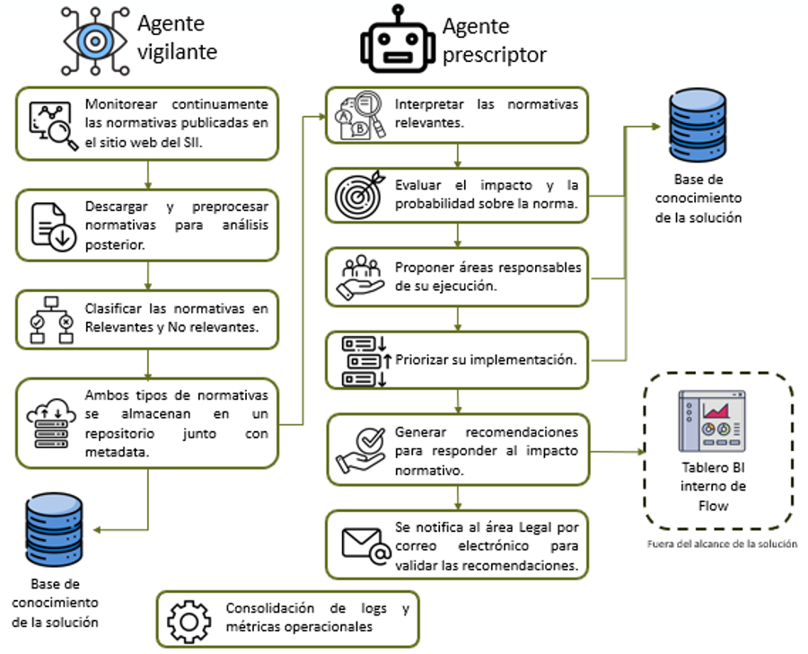

# Proyecto Capstone MIA

Este repositorio contiene un conjunto de notebooks para el análisis, procesamiento y clasificación de normativas y circulares. A continuación se presenta un índice con una breve explicación de cada notebook para facilitar la navegación y comprensión del proyecto.

## Índice de Notebooks

1. [EDA Metadata](notebooks/01_EDA_Metadata.ipynb)  
   Exploración y análisis inicial de los metadatos disponibles en el conjunto de datos. Se realiza un Análisis Exploratorio de Datos (EDA) para entender la estructura y características de los datos.

2. [Extraccion de Datos](notebooks/02_Extraccion_Datos.ipynb)  
   Proceso de extracción de datos desde las fuentes originales. Incluye la carga y consolidación de archivos CSV con normativas y circulares.

3. [Preprocesamiento, Clasifica Normativas](notebooks/03_Preprocesamiento_EDA_Clasifica_Normativas.ipynb)  
   Preprocesamiento de los datos y análisis exploratorio para la clasificación de normativas. Se preparan los datos para su posterior modelado.

4. [Preprocesamiento Embbedings_Redis](notebooks/04_Preprocesamiento_Embbedings_Redis.ipynb)  
   Generación de embeddings para los textos de las normativas y su almacenamiento en Redis para facilitar búsquedas y consultas eficientes.

5. [Agente Vigilante](notebooks/Agente_Vigilante/Modelado_AgenteVigilante.ipynb)  
  El primer agente “Vigilante” tendrá el objetivo de determinar si un documento (resolución/circular) es relevante para el negocio 

6. [Agente Prescriptor](notebooks/Agente_Prescriptor/01_EDA_Agente_Prescriptor.ipynb)
   Este agente RAG prescribe el impacto de normativas del SII sobre procesos internos de una fintech. Combina embeddings semánticos con contexto estructurado desde matrices de procesos e impactos históricos. Como salida, genera responsables, efectos esperados, niveles de riesgo y recomendaciones.
   
## Modelo de Agentes

## Estructura de Carpetas

- `notebooks/`: Contiene todos los notebooks del proyecto.
- `raw_data/`: Datos crudos originales, incluyendo archivos CSV con circulares y resoluciones por año, así como archivos de normativas clasificadas y limpias.

## Uso

Cada notebook está diseñado para ser ejecutado secuencialmente, siguiendo el flujo desde la exploración inicial hasta la implementación del agente vigilante normativo.

---

Repositorio original: [https://github.com/carizu/capstone_mia_public](https://github.com/carizu/capstone_mia_public)
